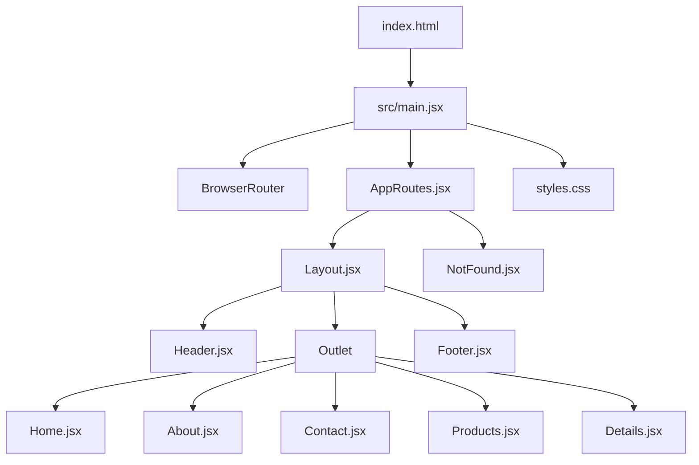

# Fluxo da aplicação

Este documento demonstra o caminho percorrido pela aplicação desde o carregamento do HTML até a renderização de cada página.

## Fluxo principal



## 1. Entrada pelo `index.html`

O navegador carrega o arquivo `index.html`. Dentro do `body` existe o elemento que receberá a aplicação React:

```html
<div id="root"></div>
<script type="module" src="/src/main.jsx"></script>
```

A tag `script` inicia o arquivo `src/main.jsx`.

## 2. Inicialização em `main.jsx`

O `main.jsx` importa o React, o ReactDOM, o `BrowserRouter`, o componente `AppRoutes` e o CSS global:

```jsx
import { BrowserRouter } from "react-router";
import { AppRoutes } from "./routes/AppRoutes";
import "./styles.css";
```

Depois, React monta a aplicação no elemento `#root`:

```jsx
ReactDOM.createRoot(document.getElementById("root")).render(
  <React.StrictMode>
    <BrowserRouter>
      <AppRoutes />
    </BrowserRouter>
  </React.StrictMode>
);
```

### Responsabilidade de cada parte

- `createRoot`: conecta o React ao elemento `#root` do HTML.
- `StrictMode`: ajuda a identificar problemas durante o desenvolvimento.
- `BrowserRouter`: habilita a navegação e a leitura da URL.
- `AppRoutes`: decide qual página deve ser exibida.
- `styles.css`: disponibiliza os estilos globais da aplicação.

## 3. Definição das rotas em `AppRoutes.jsx`

O componente `AppRoutes` usa `Routes` e `Route` para relacionar URLs aos componentes:

```jsx
<Routes>
  <Route path="/" element={<Layout />}>
    <Route index element={<Home />} />
    <Route path="about" element={<About />} />
    <Route path="contact" element={<Contact />} />
    <Route path="products" element={<Products />} />
    <Route path="products/:id" element={<Details />} />
  </Route>

  <Route path="*" element={<NotFound />} />
</Routes>
```

A rota `/` usa o `Layout` como estrutura comum. As rotas internas são renderizadas dentro do `Outlet` do `Layout`.

## 4. Funcionamento do `Layout.jsx`

O `Layout` monta os elementos que aparecem nas páginas internas:

```jsx
<Header />
<Outlet />
<Footer />
```

O resultado visual é:

```text
Header
  Página selecionada pela URL
Footer
```

O `Outlet` é o espaço reservado para a rota filha atual. Por exemplo, ao acessar `/products`, o `Products` aparece no lugar do `Outlet`.

## 5. Fluxo de cada URL

| URL | Componente renderizado dentro do `Outlet` |
| --- | --- |
| `/` | `Home.jsx` |
| `/about` | `About.jsx` |
| `/contact` | `Contact.jsx` |
| `/products` | `Products.jsx` |
| `/products/1` | `Details.jsx`, recebendo o parâmetro `id` |
| qualquer outra URL | `NotFound.jsx` |

### Exemplo: acesso a `/products`

```text
index.html
  -> main.jsx
    -> BrowserRouter
      -> AppRoutes.jsx
        -> Layout.jsx
          -> Header.jsx
          -> Outlet
            -> Products.jsx
          -> Footer.jsx
```

### Exemplo: acesso a `/products/1`

```text
index.html
  -> main.jsx
    -> BrowserRouter
      -> AppRoutes.jsx
        -> Layout.jsx
          -> Header.jsx
          -> Outlet
            -> Details.jsx
              -> useParams() lê id = "1"
          -> Footer.jsx
```

## 6. Navegação pelo `Header.jsx`

Os links do header usam o componente `Link` do React Router:

```jsx
<Link to="/">Home</Link>
<Link to="/about">Sobre</Link>
<Link to="/contact">Contato</Link>
<Link to="/products">Produtos</Link>
```

Ao clicar em um link:

1. A URL é atualizada.
2. O `BrowserRouter` identifica a nova URL.
3. `AppRoutes` seleciona a rota correspondente.
4. O conteúdo do `Outlet` é atualizado.
5. `Header` e `Footer` continuam no `Layout`.

O botão `Voltar` usa `useNavigate` para voltar no histórico do navegador:

```jsx
<button onClick={() => navigate(-1)}>Voltar</button>
```

## 7. Filtros em `Products.jsx`

A página `Products` usa `useSearchParams` para controlar filtros na URL:

```text
/products?categoria=eletrônico
/products?preco=200
/products?categoria=vestuário&preco=150
```

O fluxo é:

```text
Clique no filtro
  -> setSearchParams()
    -> URL é atualizada
      -> Products renderiza novamente
        -> produtos são filtrados
```

## Resumo

```text
index.html
  -> main.jsx
    -> BrowserRouter
      -> AppRoutes.jsx
        -> Layout.jsx
          -> Header.jsx
          -> Outlet
            -> página da rota atual
          -> Footer.jsx
```
